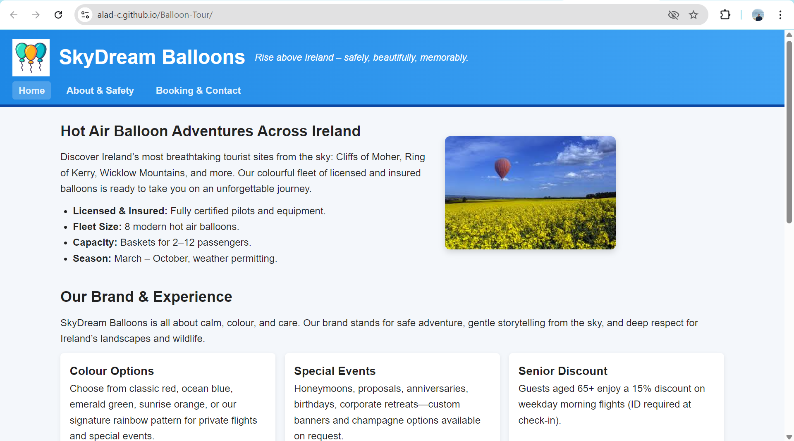
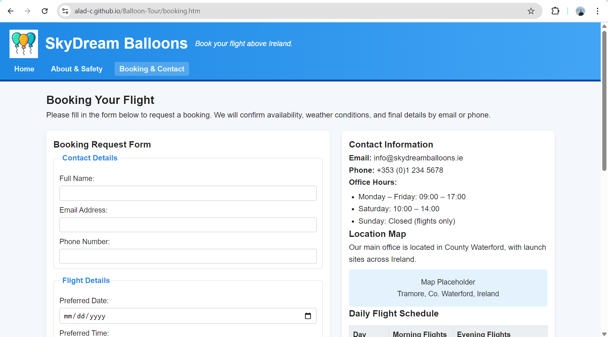

# 🎈 Balloon Tour

A modern, responsive multi-page website designed for a hot air balloon excursion company. This project showcases a professional landing page, booking flows, and historical information about balloon flights.

## 🌟 Key Features
- **Booking System:** Dedicated `booking.htm` page for user reservations.
- **Historical Insights:** A specialized section exploring the heritage of ballooning.
- **Responsive Design:** Optimized for different screen sizes using clean CSS.
- **Clean Architecture:** Simple and organized file structure for easy maintenance.

## 🛠 Built With
- **HTML5:** Semantic structure for better SEO and accessibility.
- **CSS3:** Custom styling (located in `styles.css`).
- **Images:** High-quality visual assets including `mainBalloon.png` and `historicFlight.png`.

## 🚀 Getting Started
To view the project locally, follow these steps:

1. **Clone the repository:**
   ```bash
   git clone https://github.com/Alad-c/Balloon-Tour
   ```
2. **Open the project:**
   Navigate to the folder and open `index.htm` in your preferred web browser.

## 📂 Project Structure
- `index.htm` — The main landing page.
- `booking.htm` — The tour reservation page.
- `about.htm` — Company background and information.
- `styles.css` — Core styling for the entire site.
- `/images` — Visual assets and icons.
## 📸 Screenshots




## 🌐 Live Demo
[View Live Site](https://alad-c.github.io/Balloon-Tour/)

---
*Created by [Alad-c](https://github.com/Alad-c)*
